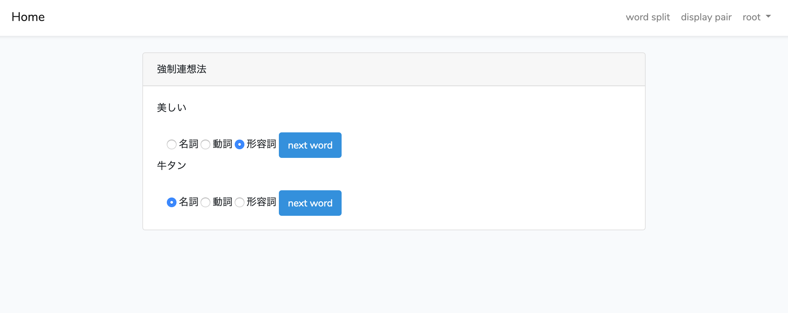
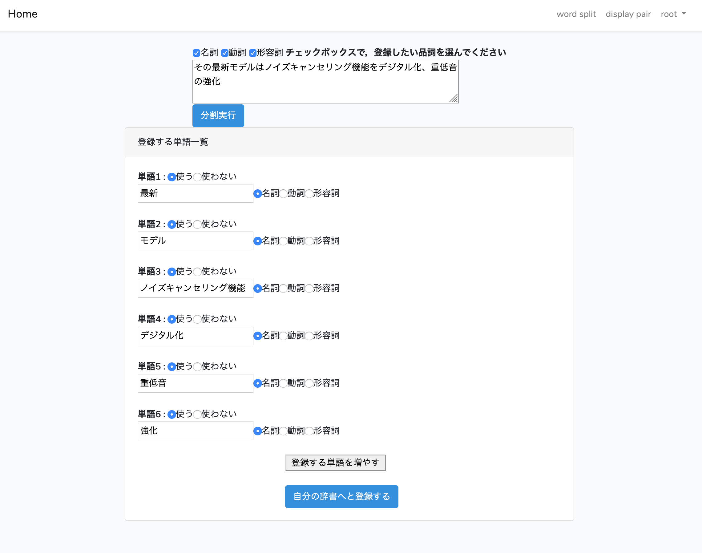
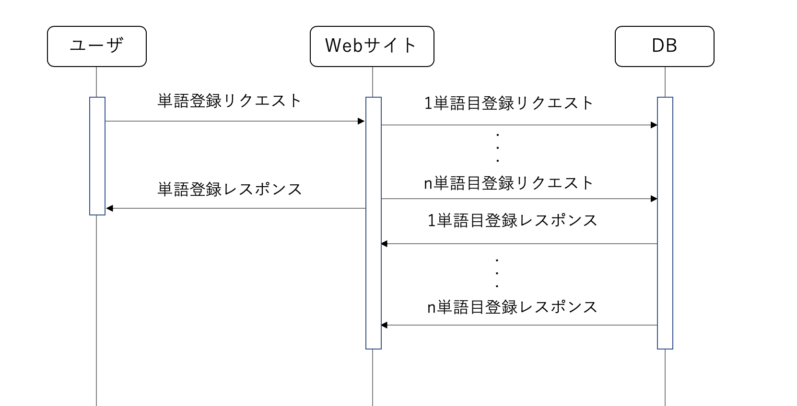

# 強制連想法Webサイト
強制連想法Webサイトのコードを管理しています．

## Webサイト URL 🌐
http://3.112.214.168/

## 強制連想法Webサイト の特長

おもに以下の５つの特徴があります．
- 強制連想法のための辞書保持
    + サーバ内に強制連想法で使う辞書が保存される
- 辞書登録機能
    + ユーザが任意の単語を登録することができる
- 自然言語処理による辞書登録サポート
    + ユーザは任意のテキストを貼り付けるだけで，キーワードを抜き出すことができる
    + 抜き出すキーワードの品詞はユーザが指定できる
- 単語ペア表示機能
    + 辞書を使い，単語のペアをランダムに表示できる
- ユーザビリティ
    + 非同期処理を使用しユーザの待ち時間を軽減
    + スマホ，PCのサイズに合わせた最適な表示がされる(レスポンシブデザイン)

## 構成技術
以下の技術を使用してあります．
- インフラ
    + Amazon Web Service
    + Docker
    + nginx
- フロントエンド
    + JavaScript
    + css
- バックエンド
    + php
    + python
- フレームワーク
    + Laravel

## 使用画面例
単語ペア表示画面

単語登録画面

## 処理フロー
複数単語登録時のシーケンス図

## 追加予定機能
今後追加していきたい機能は，以下の通りです．
- あるカテゴリの辞書を自分の辞書へ追加する機能
    + 家電，飲食などカテゴリ毎に作成された辞書をユーザの辞書へ登録する機能
- アイデア保存機能
    + 単語のペアと，そこから考えついたアイデアを保存する機能
- Twitter 連携機能
    + 単語のペアと，そこから考えついたアイデアをツイートする機能

